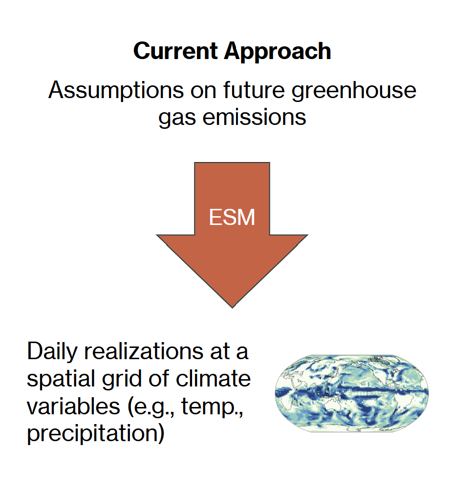
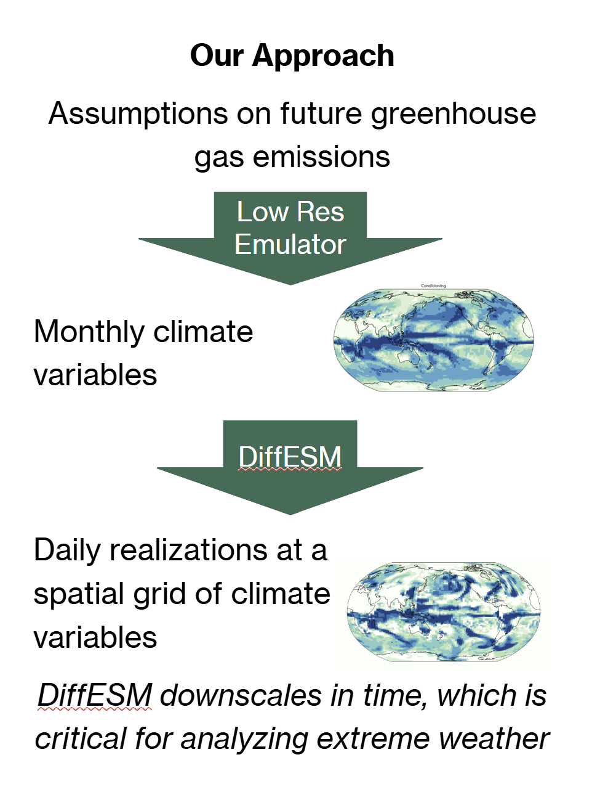
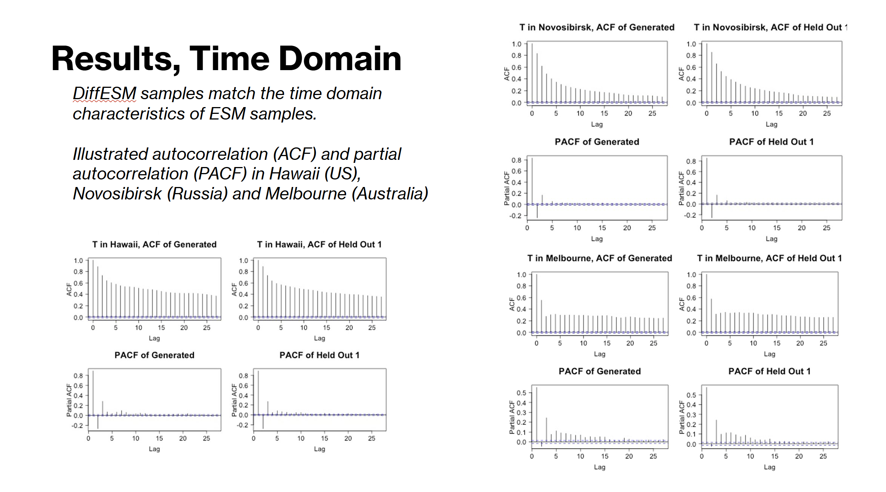
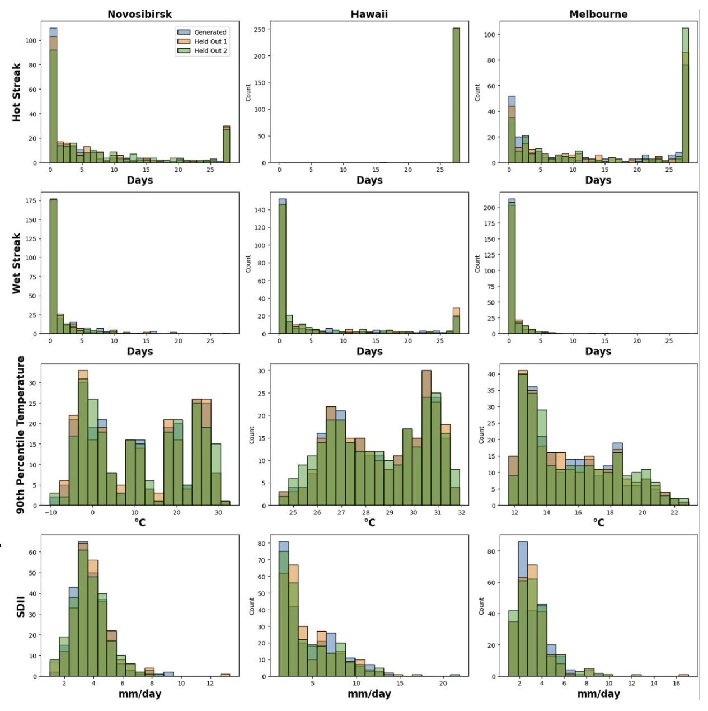
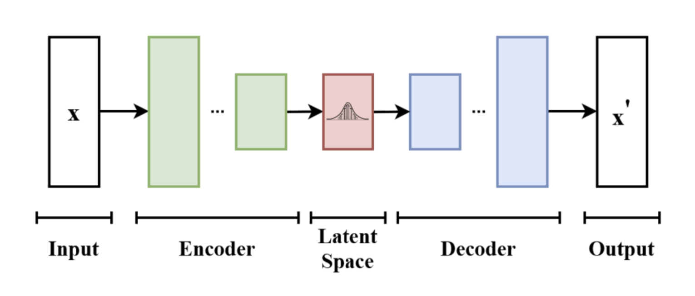
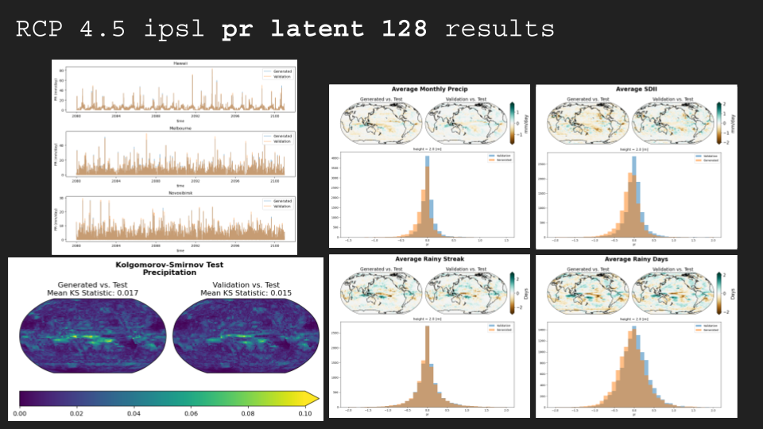
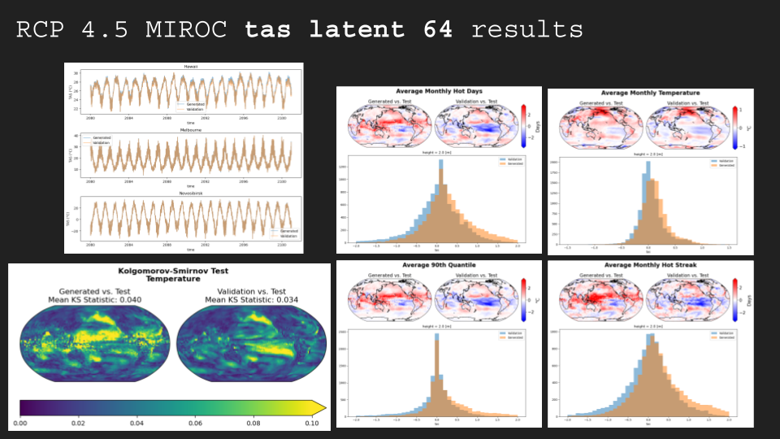
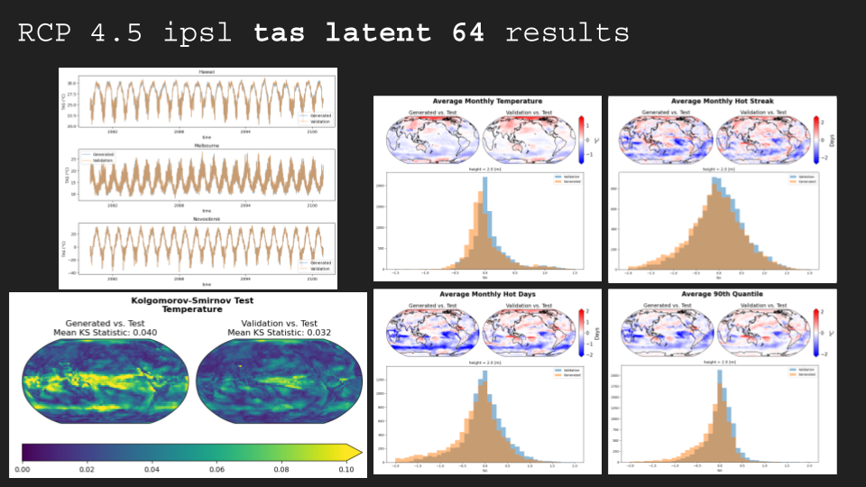

# Generative Modeling for Climate Science

This repository presents two complementary research projects from the Hutchinson Machine Learning Research Group at Western Washington University and Pacific Northwest National Laboratory (PNNL). Both explore how **generative deep learning models**—specifically **diffusion models** and **variational autoencoders (VAEs)**—can accelerate and enhance Earth system modeling.

---

## DiffESM: Emulating Earth System Models with Diffusion Models

**Advised by:** Prof. Brian Hutchinson (WWU, PNNL), Dr. Claudia Tebaldi (PNNL)  
**Supported by:** U.S. Department of Energy, Office of Science — MultiSector Dynamics, Earth and Environmental System Modeling Program  

### Overview

Earth System Models (ESMs) simulate the physical, chemical, and biological processes driving Earth’s climate. While invaluable for understanding climate futures, ESMs are **computationally expensive**, often requiring weeks to months to generate a single multi-century realization.

**DiffESM** introduces a new approach: using a **denoising diffusion probabilistic model (DDPM)** to emulate ESM behavior. Once trained, DiffESM can produce full-length, daily climate realizations in hours rather than weeks—enabling large-scale analyses of **extreme weather frequencies**, **scenario exploration**, and **climate uncertainty quantification**.

  

### Method

DiffESM extends state-of-the-art diffusion models from image generation (2D) to **spatio-temporal 3D climate data**, encoding physical domain constraints such as Earth’s spherical geometry.  
The model learns to reconstruct realistic daily temperature and precipitation patterns conditioned on monthly or annual means.

  
  

| Step | Description |
|------|--------------|
| 1 | Input: monthly or annual climate variables under specified GHG scenarios |
| 2 | Model: iterative denoising using diffusion processes |
| 3 | Output: synthetic, physically consistent daily fields |

### Results

- **Visual similarity:** DiffESM-generated fields are visually indistinguishable from ESM outputs.
    
- **Temporal accuracy:** Preserves autocorrelation (ACF) and partial autocorrelation (PACF) across global locations.
     
- **Statistical fidelity:** Matches the daily distribution of real ESM data as closely as two independent ESM runs do.
   

### Impact

- Generates 250-year daily realizations in **hours instead of weeks**  
- Generalizes to **unseen GHG scenarios**  
- Enables exploration of **future extreme weather risks** at scale  

**Publications:**
- *Journal of Advances in Modeling Earth Systems* (2024)  
- *ICLR Workshop on Tackling Climate Change with Machine Learning* (2024)

---

## ESM-VAE: Variational Autoencoder for Climate Data Compression

**Contributors:** Nina Ervin, Cooper Cox   
**Advised by:** Prof. Brian Hutchinson (WWU, PNNL), Dr. Claudia Tebaldi (PNNL)  
**Presented:** CSE External Advisory Board  

### Motivation

The **Coupled Model Intercomparison Project (CMIP6)**, containing global ESM simulations, produces over **28 petabytes** of data—creating a major bottleneck for storage, access, and analysis.  
Traditional lossy compression (e.g., JPEG-based) can significantly distort scientific data, reducing accuracy in downstream climate analyses.

The **ESM-VAE** project investigates **variational autoencoders** as a **learned compression scheme** that preserves essential climate information while drastically reducing storage requirements.

### Approach

The ESM-VAE leverages a **VAE-GAN architecture** to learn compact latent representations of daily temperature (TAS) and precipitation (PR) fields from CMIP6 models (MIROC6 and IPSL).  
It is trained on the high-emission RCP 8.5 scenario and evaluated on the moderate RCP 4.5 scenario to test generalization.
  

**Model Features**
- Encoder–decoder structure with **residual** and **attention** blocks for robust feature extraction  
- **Group normalization** and **SiLU activations** for training stability on small batch sizes  
- Evaluation via **Kullback–Leibler divergence**, **MAE**, and **Kolmogorov–Smirnov tests** to assess distributional similarity

### Results

- Achieved **high compression ratios** with **minimal reconstruction error** across global regions and decades  
- Retained **distributional consistency** between original and reconstructed data (confirmed via KS tests)  
- Model generalized effectively across unseen scenarios and ESM realizations
  
  
    
    

### Key Findings

- VAE compression significantly outperforms traditional lossy methods while preserving climate fidelity  
- Reconstruction errors increase primarily in **extreme seasons (summer, winter)**  
- Model performance remains stable over **multi-decade timescales**, highlighting robustness  

### Future Directions

- Compress multi-variable or multi-day (temporal) sequences to exploit interdependence  
- Explore **latent diffusion** for hybrid compression–generation  
- Integrate compression into generative emulation workflows (e.g., DiffESM)

---

## Joint Vision

Together, **DiffESM** and **ESM-VAE** demonstrate how generative AI can advance climate modeling by:
- **Accelerating simulations** via learned emulators  
- **Reducing data storage** through efficient compression  
- **Enabling large-scale ensemble analyses** for climate risk and adaptation research  

---

## References

- Bassetti, Hutchinson, Tebaldi, Kravitz. *DiffESM: Conditional Emulation of Temperature and Precipitation in Earth System Models with 3D Diffusion Models.* JAMES (2024).  
- Christensen, Otto, Bassetti, Tebaldi, Hutchinson. *Diffusion-Based Joint Temperature and Precipitation Emulation of Earth System Models.* ICLR (2024).  
- Ervin, Cox, Bassetti, Hutchinson, Tebaldi. *ESM-VAE: A VAE Approach for Data Compression on Earth System Model Data.* (2025).  

---

> *Harnessing generative AI to accelerate and compress Earth System Models — enabling faster, leaner, and more accessible climate science.*
